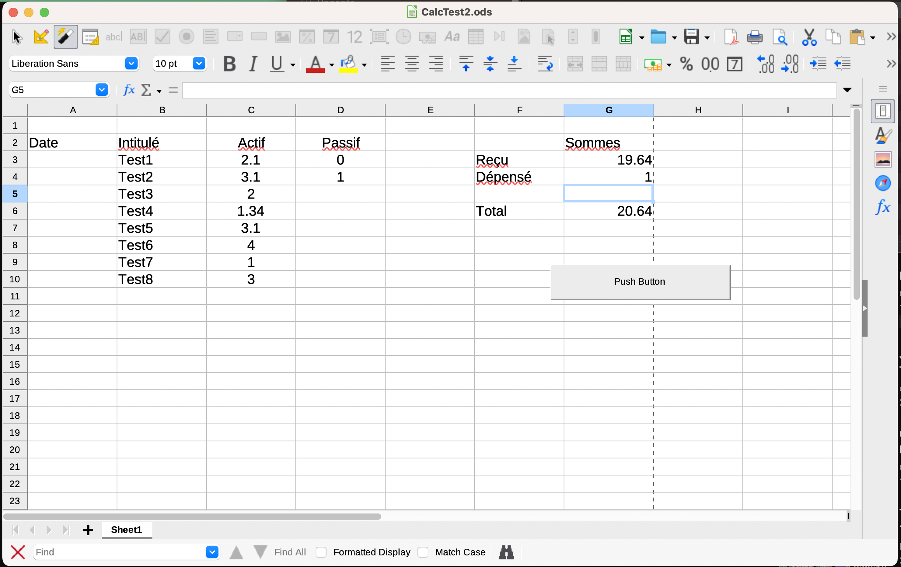
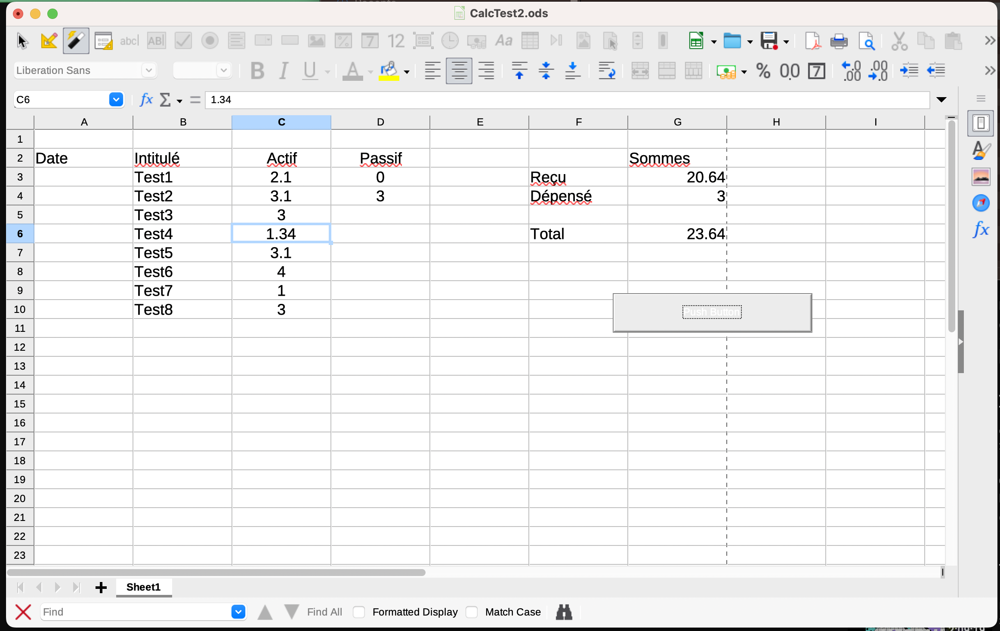

# Simple readme file

This file is a LibreOffice [^1] file CalcTest2.ods [^2].

Double click on it and, it should be launched. 

Set your LibreOffice to launch macro.


# Introduction
Fill these columns with date, cost name and, its associated values (actif or Passif).

Press the button and, calculus will be made for you.

| Date | Intitulé | Actif | Passif |
| ----------- | ----------- | ----------- | ----------- |
| 202301P1 | Puchase 1 | 10 | |
| 202301P1 | Puchase 2 |  | 2|

<!--


-->


# Improve macro
Tools > Macro > Edit Macros

Go in Object catalog then choose CalcTest2.ods

Select Module and choose Calc()

```
Sub Calc()
	MaSomme("Sheet1","Actif","Reçu")
	MaSomme("Sheet1","Passif","Dépensé")
	MaSomme("Sheet1","Sommes","Total")
End Sub
```
[](https://youtu.be/lyE_5vgkkng)

[^1]: Version 7.4.2.3
[^2]: [Manual](https://help.libreoffice.org/7.4/en-US/text/sbasic/shared/vbasupport.html?&DbPAR=SHARED&System=MAC) for writing VBA scripts
